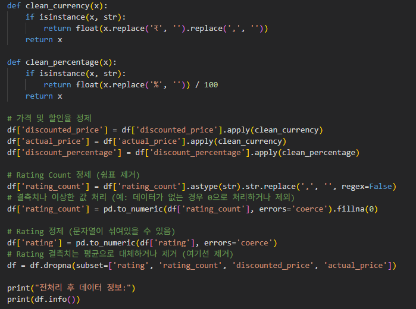
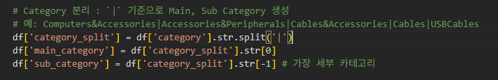
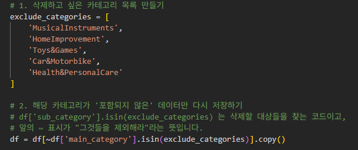
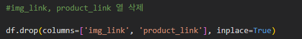
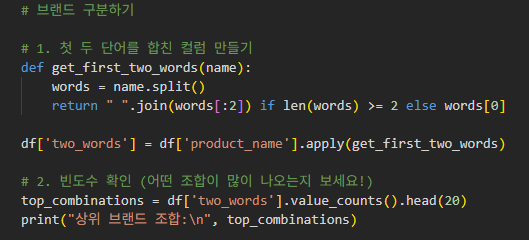
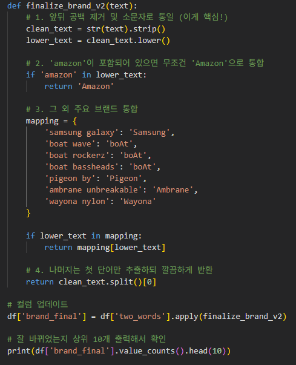
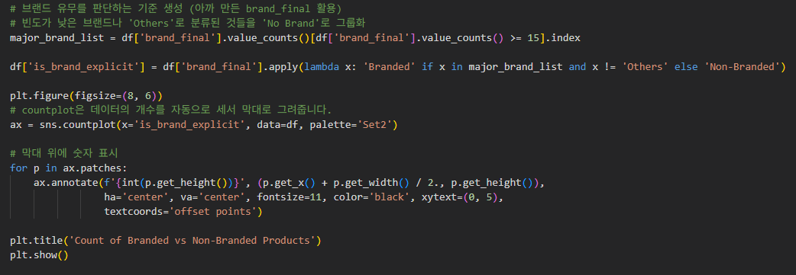
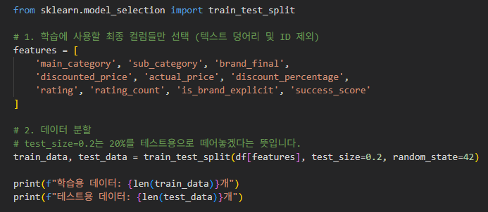

# Amazon 제품 성공 점수 예측 (Amazon Product Success Prediction)

이 프로젝트는 Amazon 판매 데이터를 기반으로 제품의 **성공 점수(Success Score)**를 예측하는 머신러닝 모델을 구축하는 프로젝트입니다. 데이터 전처리부터 파생 변수(Feature Engineering) 생성, 탐색적 데이터 분석(EDA), 그리고 **AutoGluon**을 이용한 자동화된 머신러닝 모델링까지의 전체 파이프라인을 포함하고 있습니다.

## 1. 프로젝트 개요 (Overview)
*   **목표**: 제품의 가격, 할인율, 카테고리, 브랜드 등의 정보를 활용하여 해당 제품의 시장 성공 가능성을 수치화한 'Success Score'를 예측합니다.
*   **사용 라이브러리**: `autogluon.tabular`, `pandas`, `numpy`, `matplotlib`, `seaborn`, `plotly`, `scikit-learn`
*   **핵심 도구**: **AutoGluon** (TabularPredictor)

## 2. 데이터셋 (Dataset)
*   **소스**: Amazon Sales Dataset (`amazon.csv`)
*   **주요 특징**:
    *   제품 식별 및 설명: `product_id`, `product_name`, `about_product`
    *   카테고리: `category` (대분류|중분류|소분류|...)
    *   가격 정보: `discounted_price`, `actual_price`, `discount_percentage`
    *   평가 정보: `rating`, `rating_count`
    *   기타: `img_link`, `product_link` (모델링 시 제외)

## 3. 데이터 전처리 (Data Preprocessing)
Raw Data를 분석 및 모델링에 적합한 형태로 정제하였습니다.
1.  **가격 및 수치 변환**:
    *   `discounted_price`, `actual_price`: 통화 기호(`₹`)와 천 단위 구분자(`,`)를 제거하고 실수형(float)으로 변환했습니다.
    *   `discount_percentage`: 퍼센트 기호(`%`)를 제거하고 수치형으로 변환했습니다.
    *   `rating`, `rating_count`: 문자열을 수치형으로 변환하고 오류 값을 처리했습니다.
    
    

2.  **카테고리 분리**:
    *   `category` 컬럼을 `|` 기준으로 분리하여 `main_category`와 `sub_category`를 추출했습니다.
    *   분석에 방해가 되는 특정 카테고리(예: `Car&Motorbike`)를 제외했습니다.
    
    
3.  **결측치 및 이상치 처리**:
    *   필수 수치 데이터(`actual_price`, `discounted_price`, `rating`)에 결측치가 있는 행을 제거했습니다.
    *   `rating_count`가 없는 경우 0으로 대체하거나 제외했습니다.
4.  **불필요한 컬럼 제거**: 시각적/링크 정보(`img_link`, `product_link`, `product_id`, `user_id`, `review_id` 등)는 학습에서 제외했습니다.

## 4. 피처 엔지니어링 (Feature Engineering)
예측력을 높이기 위해 도메인 지식을 반영한 파생 변수를 생성했습니다.
1.  **Success Score (Target Variable)**:
    *   정의: 평점(`rating`)과 리뷰 수(`rating_count`)를 결합한 성공 지표.
    *   수식: $$ \text{Success Score} = \text{Rating} \times \log_{10}(\text{Rating Count} + 1) $$
    *   목적: 단순히 평점이 높은 것보다, 많은 리뷰를 통해 검증된 평점 높은 제품에 가중치를 두어 '성공'을 정의했습니다.
    *   리뷰 수의 극단적인 편차를 완화하여, 소수의 대박 상품에만 모델이 편향되지 않도록 함과 동시에 '품질(Rating)'과 '인지도(Count)'의 균형을 맞춤.
    
2.  **브랜드 추출 및 정제 (`brand_final`)**:
    *   제품명(`product_name`)에서 첫 두 단어를 추출하여 브랜드 후보를 생성했습니다.
    *   주요 브랜드(Samsung, boAt, Sony 등)에 대해 텍스트 정규화(대소문자 통일 등)를 수행했습니다.
    
    
    
    

3.  **브랜드 유무 (`is_brand_explicit`)**:
    *   빈도수가 높은 상위 15개 브랜드를 `Branded`, 그 외를 `Non-Branded`로 분류하여 브랜드 파워가 성공 점수에 미치는 영향을 반영했습니다.
    
    
    

## 5. 탐색적 데이터 분석 (EDA)
데이터의 분포와 관계를 파악하기 위해 다양한 시각화를 수행했습니다.
*   **카테고리 분포**: `Electronics`, `Computers&Accessories` 등 주요 `main_category`와 `sub_category`의 제품 수 분포를 바 차트로 시각화했습니다.
    
    
    
    
    
    
*   **가격 및 할인율 분석**:
    *   **3D Scatter Plot (1)**: `actual_price` (x), `discount_percentage` (y), `rating` (z) 간의 관계를 시각화하여 가격 정책과 만족도의 상관성을 탐색했습니다.
    *   **3D Scatter Plot (2)**: `actual_price` (x), `discounted_price` (y), `rating_count` (z) 관계를 통해 가성비 제품 구간을 확인했습니다.
*   **브랜드별 성공 점수**: 주요 브랜드(`brand_final`)별 평균 `success_score`를 비교하여 특정 브랜드의 우위를 확인했습니다.
    
    

## 6. 모델링 (Modeling)
**AutoGluon**을 활용하여 최적의 회귀 모델을 탐색했습니다.
*   **설정**:
    *   타겟: `success_score`
    *   평가 지표: `root_mean_squared_error` (RMSE)
    *   프리셋: `best_quality` (Bagging, Stacking 등을 포함한 고성능 모드)
    *   시간 제한: 600초 (10분)
    
*   **사용 알고리즘**:
    *   `WeightedEnsemble_L2`, `CatBoost`, `XGBoost`, `LightGBM`, `RandomForest`, `NeuralNetFastAI` 등 다양한 알고리즘을 자동으로 학습하고 앙상블했습니다.

## 7. 결과 (Results)
*   **최적 모델**: `WeightedEnsemble_L2` (여러 모델의 가중 평균)
*   **성능 지표**:
    *   **RMSE**: 약 0.14 (Validation Set 기준)
    *   **R² Score**: 0.99 이상
*   **결론**:
    *   모델은 `actual_price`, `discount_percentage`, `brand_final` 등의 피처를 기반으로 제품의 성공 점수를 매우 높은 정확도로 예측했습니다.
    *   실제값(x)과 예측값(y)의 회귀 플롯(Regplot)에서 데이터 포인트들이 대각선에 밀집하여 우수한 예측 성능을 시각적으로 확인했습니다.
    
    

## 8. 한계점
*   **데이터 편향성**: 수집된 데이터의 90% 이상이 평점 3.5~4.5점 사이에 집중되어 있어, '성공하지 못한 제품(낮은 평점)'에 대한 학습 사례가 부족한 한계가 있습니다.
    
*   **평점 타겟의 한계**: 단순히 rating만을 타겟으로 설정했을 때는 데이터의 상향 평준화로 인해 변별력이 낮았으나 Success Score를 통해 이를 극복했습니다.
*   **R² 점수에 대한 해석**: 매우 높은 예측 성능은 Success Score 구성 요소인 rating_count의 로그 변환값이 모델 학습에 지배적인 역할을 했기 때문으로 분석됩니다.