# Amazon 제품 성공 점수 예측 (Amazon Product Success Prediction)

이 프로젝트는 Amazon 판매 데이터를 기반으로 제품의 **성공 점수(Success Score)**를 예측하는 머신러닝 모델을 구축하는 프로젝트입니다. 데이터 전처리부터 파생 변수(Feature Engineering) 생성, 탐색적 데이터 분석(EDA), 그리고 **AutoGluon**을 이용한 자동화된 머신러닝 모델링까지의 전체 파이프라인을 포함하고 있습니다.

## 1. 프로젝트 개요 (Overview)
*   **목표**: 제품의 가격, 할인율, 카테고리, 브랜드 등의 정보를 활용하여 해당 제품의 시장 성공 가능성을 수치화한 'Success Score'를 예측합니다.
*   **사용 라이브러리**: `autogluon.tabular`, `pandas`, `numpy`, `matplotlib`, `seaborn`, `plotly`, `scikit-learn`
*   **핵심 도구**: **AutoGluon** (TabularPredictor)

```python
import pandas as pd
import numpy as np
import matplotlib.pyplot as plt
import seaborn as sns
from autogluon.tabular import TabularDataset, TabularPredictor
from sklearn.model_selection import train_test_split
```

## 2. 데이터셋 (Dataset)
*   **소스**: Amazon Sales Dataset (`amazon.csv`)
*   **주요 특징**:
    *   제품 식별 및 설명: `product_id`, `product_name`, `about_product`
    *   카테고리: `category` (대분류|중분류|소분류|...)
    *   가격 정보: `discounted_price`, `actual_price`, `discount_percentage`
    *   평가 정보: `rating`, `rating_count`
    *   기타: `img_link`, `product_link` (모델링 시 제외)

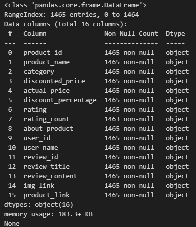

## 3. 데이터 전처리 (Data Preprocessing) 및 탐색적 데이터 분석(EDA)
Raw Data를 분석 및 모델링에 적합한 형태로 정제하였습니다.
데이터의 분포와 관계를 파악하기 위해 다양한 시각화를 수행했습니다.

1.  **가격 및 수치 변환, 결측치+이상치 정리**:
    *   `discounted_price`, `actual_price`: 통화 기호(`₹`)와 천 단위 구분자(`,`)를 제거하고 실수형(float)으로 변환했습니다.
    *   `discount_percentage`: 퍼센트 기호(`%`)를 제거하고 수치형으로 변환했습니다.
    *   `rating`, `rating_count`: 문자열을 수치형으로 변환하고 오류 값을 처리했습니다.
    ```python
    def clean_currency(x):
        if isinstance(x, str):
            return float(x.replace('₹', '').replace(',', ''))
        return x
    
    def clean_percentage(x):
        if isinstance(x, str):
        return float(x.replace('%', '')) / 100
    return x

    # 가격 및 할인율 정제
    df['discounted_price'] = df['discounted_price'].apply(clean_currency)
    df['actual_price'] = df['actual_price'].apply(clean_currency)
    df['discount_percentage'] = df['discount_percentage'].apply(clean_percentage)

    # Rating Count 정제 (쉼표 제거)
    df['rating_count'] = df['rating_count'].astype(str).str.replace(',', '', regex=False)
    # 결측치나 이상한 값 처리 (예: 데이터가 없는 경우 0으로 처리하거나 제외)
    df['rating_count'] = pd.to_numeric(df['rating_count'], errors='coerce').fillna(0)

    # Rating 정제 (문자열이 섞여있을 수 있음)
    df['rating'] = pd.to_numeric(df['rating'], errors='coerce')
    # Rating 결측치는 제거 
    df = df.dropna(subset=['rating', 'rating_count', 'discounted_price', 'actual_price'])

    print("전처리 후 데이터 정보:")
    print(df.info())
    ```

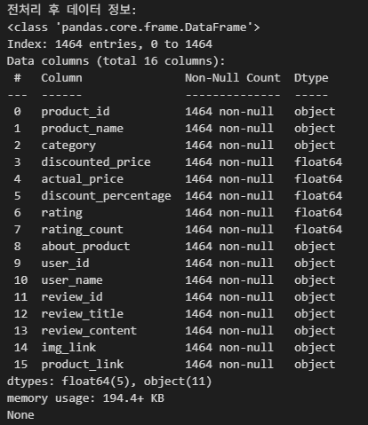

2.  **카테고리 분리**:
    *   `category` 컬럼을 `|` 기준으로 분리하여 `main_category`와 `sub_category`를 추출했습니다.
    *   분석에 방해가 되는 특정 카테고리(예: `Car&Motorbike`)를 제외했습니다.
    
    ```python
    # Category 분리 : `|` 기준으로 Main, Sub Category 생성
    # 예: Computers&Accessories|Accessories&Peripherals|Cables&Accessories|Cables|USBCables
    df['category_split'] = df['category'].str.split('|')
    df['main_category'] = df['category_split'].str[0]
    df['sub_category'] = df['category_split'].str[-1]
    ```

    ```python
    # 1. 삭제하고 싶은 카테고리 목록 만들기
    exclude_categories = [
        'MusicalInstruments', 
        'HomeImprovement', 
        'Toys&Games', 
        'Car&Motorbike', 
        'Health&PersonalCare'
    ]
    # 2. 해당 카테고리가 '포함되지 않은' 데이터만 다시 저장하기
    df = df[~df['main_category'].isin(exclude_categories)].copy()
    ```

3.  **불필요한 컬럼 제거**: 시각적/링크 정보(`img_link`, `product_link`, `product_id`, `user_id`, `review_id` 등)는 학습에서 제외했습니다.
    ```python
    df.drop(columns=['img_link', 'product_link', 'product_id', 'user_id', 'review_id'], inplace=True)
    ```

*   **카테고리 분포**: `Electronics`, `Computers&Accessories` 등 주요 `main_category`와 `sub_category`의 제품 수 분포를 바 차트로 시각화했습니다.
    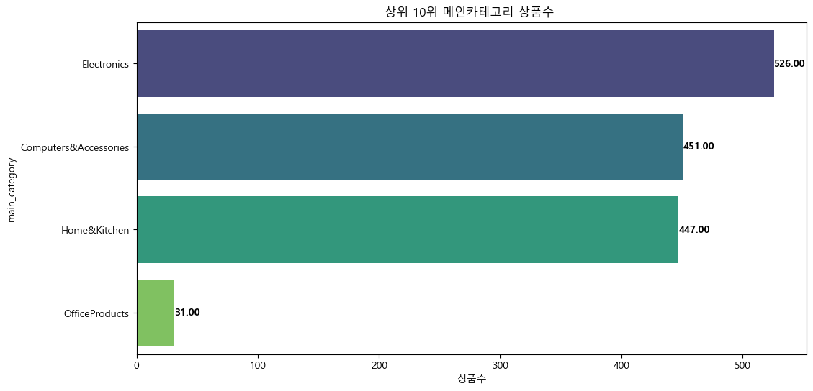
    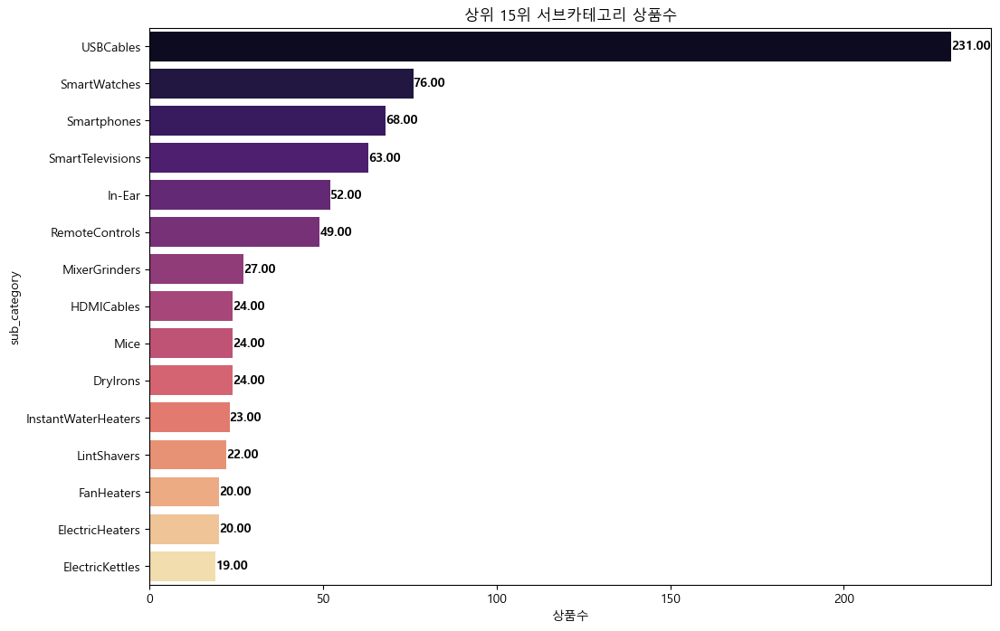
    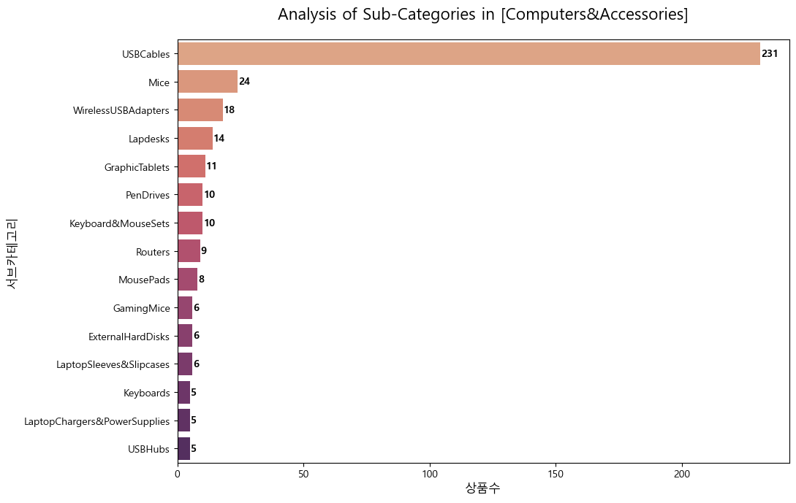
    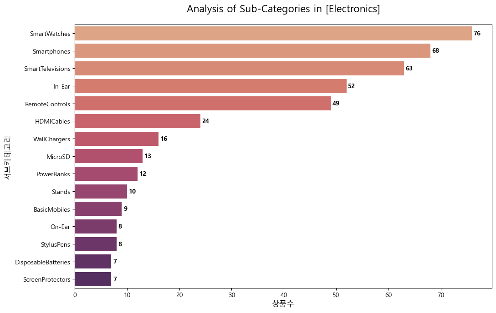
    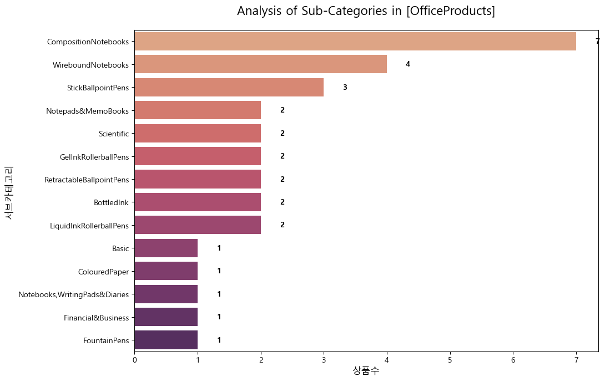
    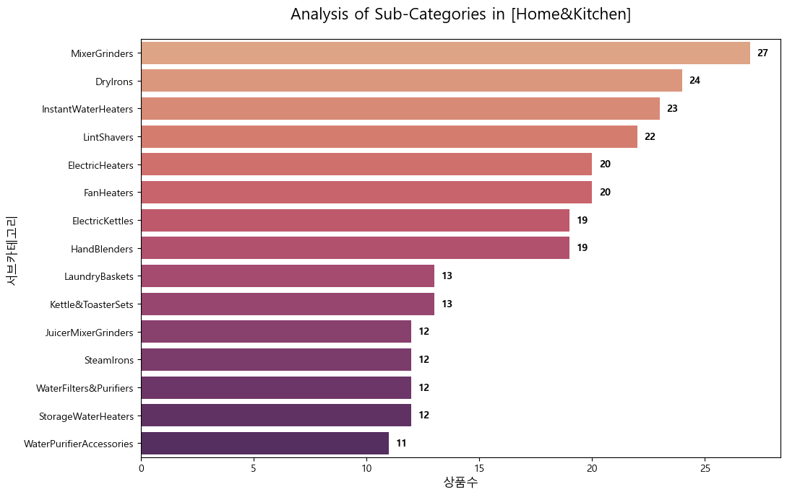
*   **가격 및 할인율 분석**:
    *   **3D Scatter Plot (1)**: `actual_price` (x), `discount_percentage` (y), `rating` (z) 간의 관계를 시각화하여 가격 정책과 만족도의 상관성을 탐색했습니다.
    *   **3D Scatter Plot (2)**: `actual_price` (x), `discounted_price` (y), `rating_count` (z) 관계를 통해 가성비 제품 구간을 확인했습니다.
*   **브랜드별 성공 점수**: 주요 브랜드(`brand_final`)별 평균 `success_score`를 비교하여 특정 브랜드의 우위를 확인했습니다.
    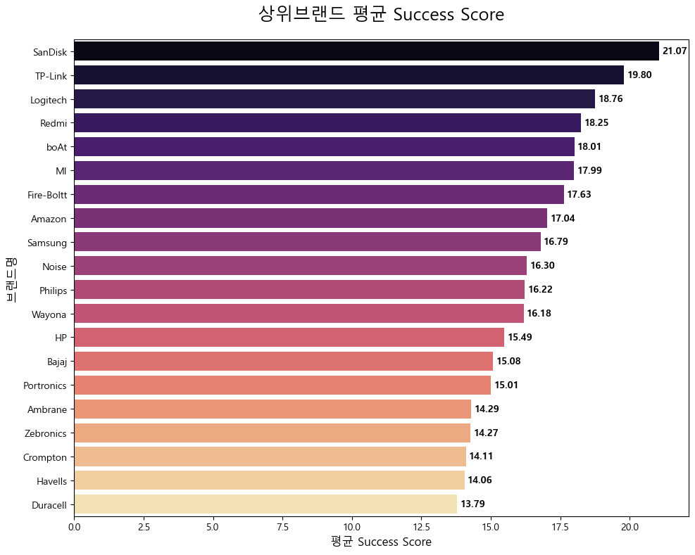
    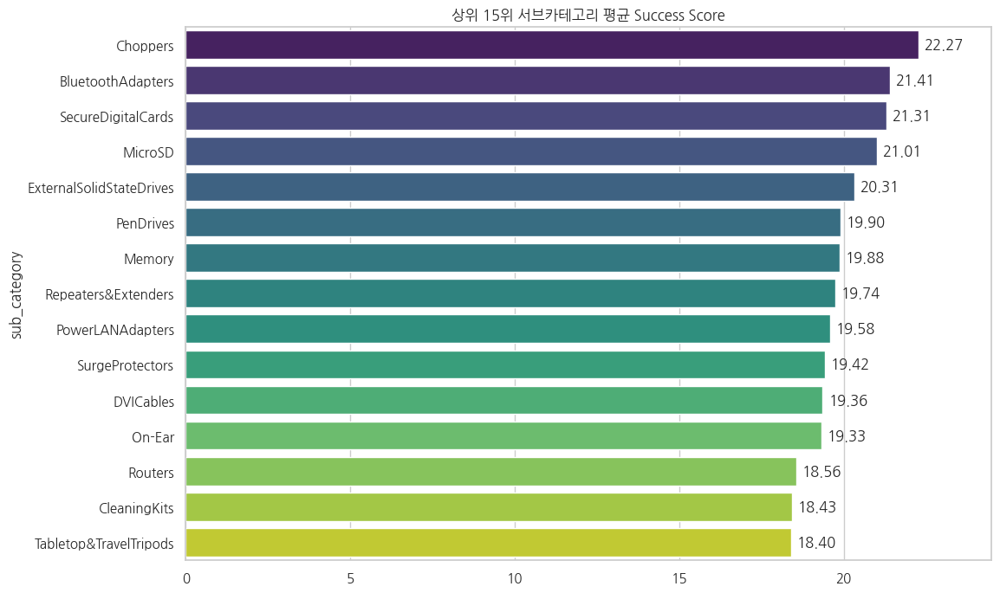

## 4. 피처 엔지니어링 (Feature Engineering)
예측력을 높이기 위해 도메인 지식을 반영한 파생 변수를 생성했습니다.
1.  **Success Score (Target Variable)**:
    *   정의: 평점(`rating`)과 리뷰 수(`rating_count`)를 결합한 성공 지표.
    *   수식: $$ \text{Success Score} = \text{Rating} \times \log_{10}(\text{Rating Count} + 1) $$
    *   목적: 단순히 평점이 높은 것보다, 많은 리뷰를 통해 검증된 평점 높은 제품에 가중치를 두어 '성공'을 정의했습니다.
    *   리뷰 수의 극단적인 편차를 완화하여, 소수의 대박 상품에만 모델이 편향되지 않도록 함과 동시에 '품질(Rating)'과 '인지도(Count)'의 균형을 맞춤.
    ```python
    # **Success Score 정의**: `Rating * log10(Rating_Count + 1)
    # Success Score 계산
    # 로그를 취해 Rating Count의 스케일을 조정하고 Rating과 곱함
    # rating이 같더라도 rating_count의 따라 rating의 신뢰도가 다르므로 비교할 수 있도록 로그로 변환한 Success Score 정의 
    df['success_score'] = df['rating'] * np.log10(df['rating_count'] + 1)
    display(df[['product_name', 'main_category', 'sub_category', 'rating', 'rating_count', 'success_score']].head())
    ```
    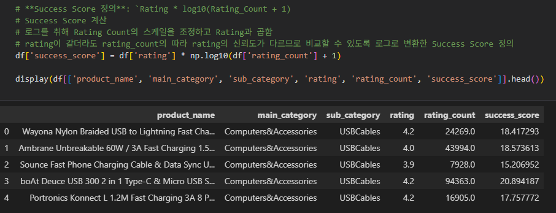

2.  **브랜드 추출 및 정제 (`brand_final`)**:
    *   제품명(`product_name`)에서 첫 두 단어를 추출하여 브랜드 후보를 생성했습니다.
    *   주요 브랜드(Samsung, boAt, Sony 등)에 대해 텍스트 정규화(대소문자 통일 등)를 수행했습니다.
    ```python
    # 브랜드 구분하기

    # 1. 첫 두 단어를 합친 컬럼 만들기
    def get_first_two_words(name):
        words = name.split()
        return " ".join(words[:2]) if len(words) >= 2 else words[0]

    df['two_words'] = df['product_name'].apply(get_first_two_words)

    # 2. 빈도수 확인
    top_combinations = df['two_words'].value_counts().head(20)
    print("상위 브랜드 조합:\n", top_combinations)
    ```
    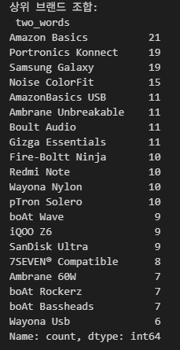

    ```python
    def finalize_brand_v2(text):
    # 1. 앞뒤 공백 제거 및 소문자로 통일
    clean_text = str(text).strip()
    lower_text = clean_text.lower()
    
    # 2. 'amazon'이 포함되어 있으면 무조건 'Amazon'으로 통합
    if 'amazon' in lower_text:
        return 'Amazon'
    
    # 3. 그 외 주요 브랜드 통합
    mapping = {
        'samsung galaxy': 'Samsung',
        'boat wave': 'boAt',
        'boat rockerz': 'boAt',
        'boat bassheads': 'boAt',
        'pigeon by': 'Pigeon',
        'ambrane unbreakable': 'Ambrane',
        'wayona nylon': 'Wayona'
    }
    
    if lower_text in mapping:
        return mapping[lower_text]
    
    # 4. 나머지는 첫 단어만 추출하되 깔끔하게 반환
    return clean_text.split()[0]

    # 컬럼 업데이트
    df['brand_final'] = df['two_words'].apply(finalize_brand_v2)

    # 잘 바뀌었는지 상위 10개 출력해서 확인
    print(df['brand_final'].value_counts().head(10))
    ```
    

3.  **브랜드 유무 (`is_brand_explicit`)**:
    *   빈도수가 높은 상위 15개 브랜드를 `Branded`, 그 외를 `Non-Branded`로 분류하여 브랜드 파워가 성공 점수에 미치는 영향을 반영했습니다.

    ```python
    # 브랜드 유무를 판단하는 기준 생성 (아까 만든 brand_final 활용)
    # 빈도가 낮은 브랜드나 'Others'로 분류된 것들을 'No Brand'로 그룹화
    major_brand_list = df['brand_final'].value_counts()[df['brand_final'].value_counts() >= 15].index

    df['is_brand_explicit'] = df['brand_final'].apply(lambda x: 'Branded' if x in major_brand_list and x != 'Others' else 'Non-Branded')

    plt.figure(figsize=(8, 6))
    # countplot은 데이터의 개수를 자동으로 세서 막대로 그려줍니다.
    ax = sns.countplot(x='is_brand_explicit', data=df, palette='Set2')

    # 막대 위에 숫자 표시
    for p in ax.patches:
        ax.annotate(f'{int(p.get_height())}', (p.get_x() + p.get_width() / 2., p.get_height()),
                    ha='center', va='center', fontsize=11, color='black', xytext=(0, 5),
                    textcoords='offset points')
    
    plt.title('Count of Branded vs Non-Branded Products')
    plt.show()
    ```

    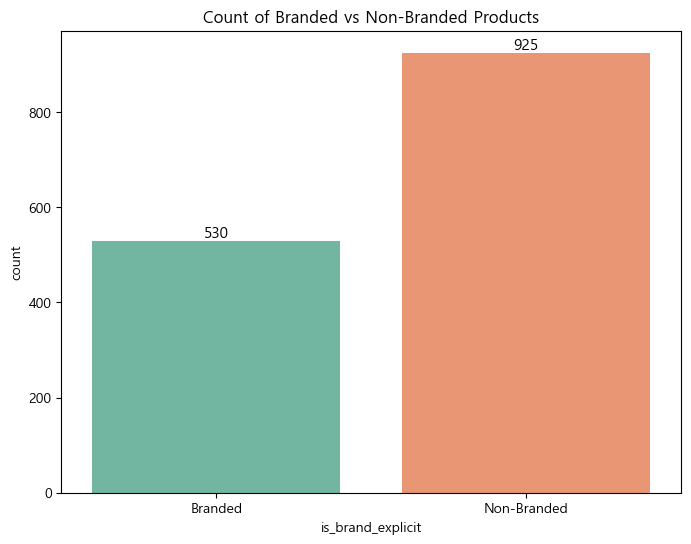
    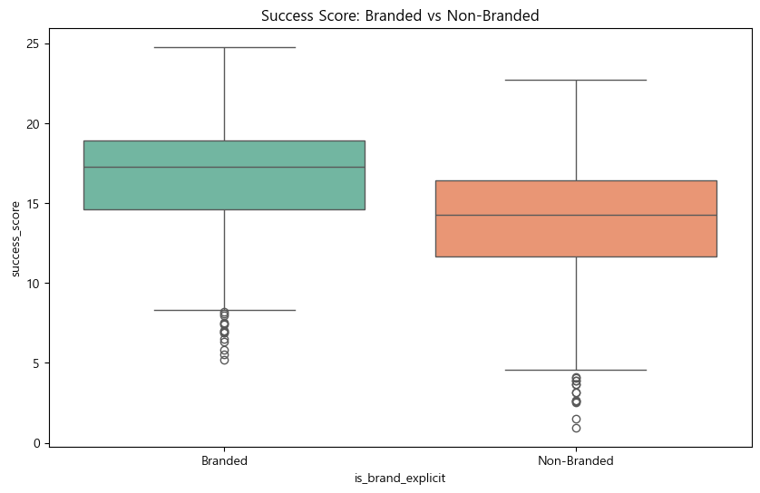

4. **히트맵 분석**
    ```python
    # 1. 브랜드 유무를 숫자로 변환 (Branded: 1, Non-Branded: 0)
    df['is_brand_binary'] = df['is_brand_explicit'].map({'Branded': 1, 'Non-Branded': 0})

    # 2. 히트맵에 포함할 숫자형 컬럼 선택
    # 수치형 데이터(float64)와 새로 만든 바이너리 변수만 추출합니다.
    numeric_cols = [
        'discounted_price', 'actual_price', 'discount_percentage', 
        'rating', 'rating_count', 'success_score', 'is_brand_binary'
    ]

    # 3. 상관계수 계산
    corr_matrix = df[numeric_cols].corr()

    # 4. 시각화
    plt.figure(figsize=(10, 8))
    sns.heatmap(corr_matrix, annot=True, fmt=".2f", cmap='coolwarm', center=0)
    plt.title('Feature Correlation Heatmap', fontsize=16)
    plt.show()
    ```

    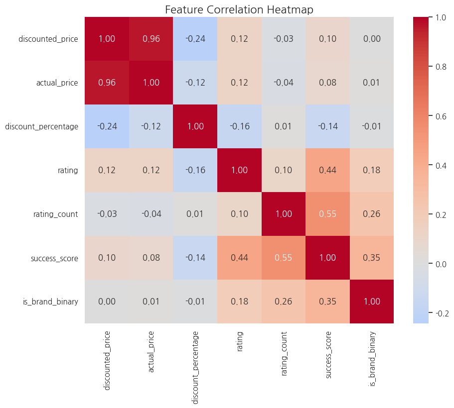

## 6. 모델링 (Modeling)
**AutoGluon**을 활용하여 최적의 회귀 모델을 탐색했습니다.
*   **설정**:
    *   타겟: `success_score`
    *   평가 지표: `root_mean_squared_error` (RMSE)
    *   프리셋: `best_quality` (Bagging, Stacking 등을 포함한 고성능 모드)
    *   시간 제한: 600초 (10분)
    ```python
    # 1. 학습에 사용할 최종 컬럼들만 선택 (텍스트 덩어리 및 ID 제외)
    features = [
        'main_category', 'sub_category', 'brand_final', 
        'discounted_price', 'actual_price', 'discount_percentage', 
        'rating', 'rating_count', 'is_brand_explicit', 'success_score'
    ]

    # 2. 데이터 분할
    # test_size=0.2는 20%를 테스트용으로 떼어놓겠다는 뜻입니다.
    train_data, test_data = train_test_split(df[features], test_size=0.2, random_state=42)

    print(f"학습용 데이터: {len(train_data)}개")
    print(f"테스트용 데이터: {len(test_data)}개")
    ```

*   **사용 알고리즘**:
    *   `WeightedEnsemble_L2`, `CatBoost`, `XGBoost`, `LightGBM`, `RandomForest`, `NeuralNetFastAI` 등 다양한 알고리즘을 자동으로 학습하고 앙상블했습니다.

## 7. 결과 (Results)
*   **최적 모델**: `WeightedEnsemble_L2` (여러 모델의 가중 평균)
*   **성능 지표**:
    *   **RMSE**: 약 0.14 (Validation Set 기준)
    *   **R² Score**: 0.99 이상
*   **결론**:
    *   모델은 `actual_price`, `discount_percentage`, `brand_final` 등의 피처를 기반으로 제품의 성공 점수를 매우 높은 정확도로 예측했습니다.
    *   실제값(x)과 예측값(y)의 회귀 플롯(Regplot)에서 데이터 포인트들이 대각선에 밀집하여 우수한 예측 성능을 시각적으로 확인했습니다.
    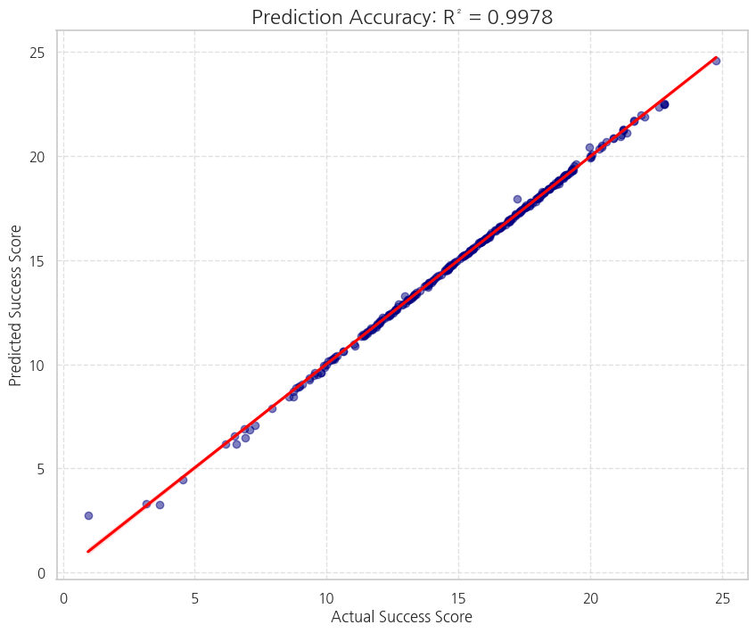
    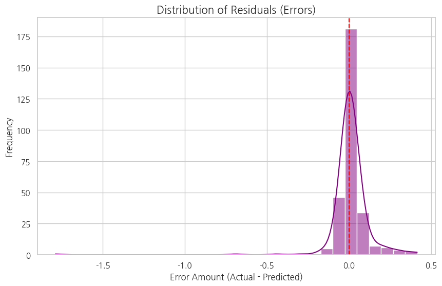

## 8. 한계점
*   **데이터 편향성**: 수집된 데이터의 90% 이상이 평점 3.5~4.5점 사이에 집중되어 있어, '성공하지 못한 제품(낮은 평점)'에 대한 학습 사례가 부족한 한계가 있습니다.
    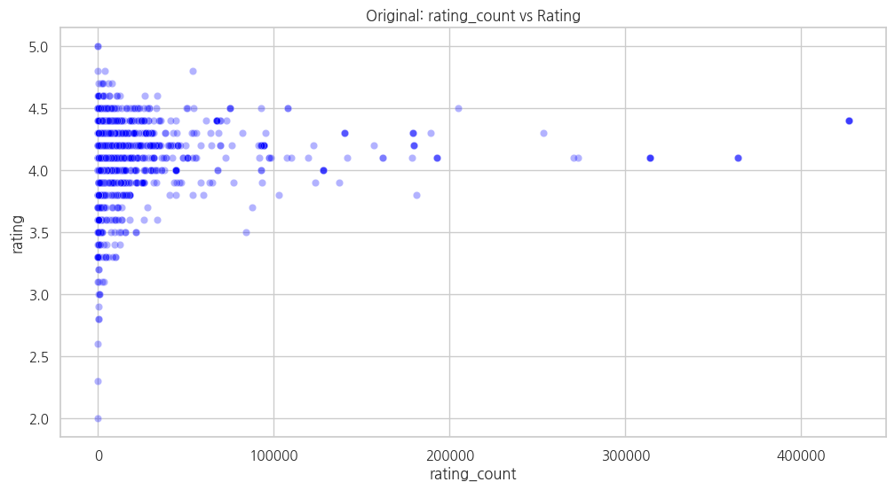
*   **평점 타겟의 한계**: 단순히 rating만을 타겟으로 설정했을 때는 데이터의 상향 평준화로 인해 변별력이 낮았으나 Success Score를 통해 이를 극복했습니다.
*   **R² 점수에 대한 해석**: 매우 높은 예측 성능은 Success Score 구성 요소인 rating_count의 로그 변환값이 모델 학습에 지배적인 역할을 했기 때문으로 분석됩니다.